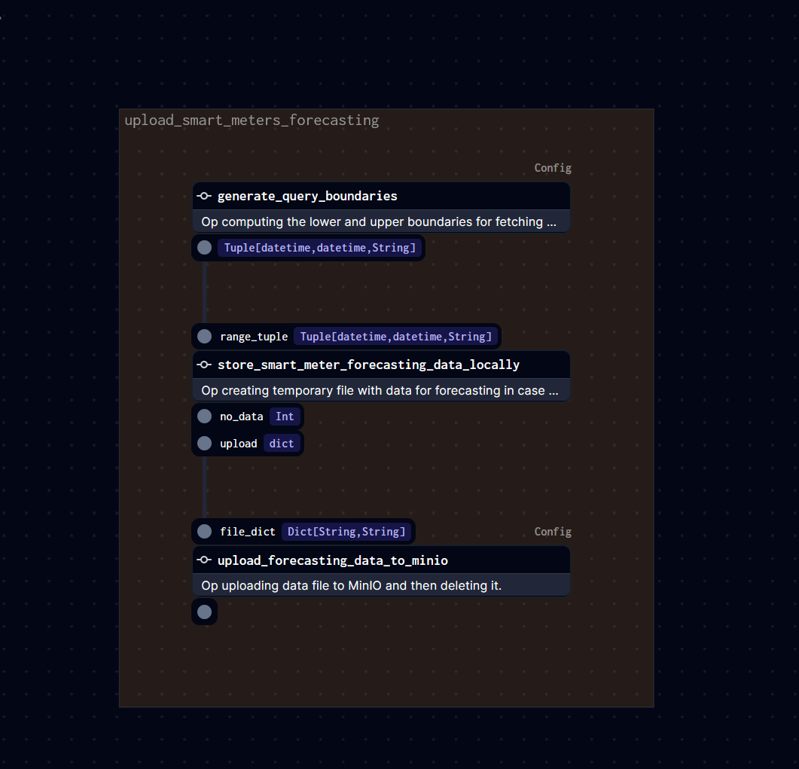

# I-NERGY: FlexDR orchestrated workflows

## Repository information
This repository contains the workflows supporting the FlexDR application. \
FlexDR requires the scheduled execution of these workflows. \
To achieve this, I-NERGY project utilises [Dagster](https://dagster.io/) as the orchestrator engine.

## Workflows within FlexDR
This section aims to describe the workflows involved in FlexDR.
A critical process for FlexDR is the prediction of day-ahead clusters.
This task is closely connected with the corresponding day-ahead prediction
of electricity load for the smart meters involved in the energy community.
The aforementioned tasks require at first the smart meters data to be in appropriate form.

### Smart meters data processing
Smart meters timeseries data are stored in the I-NERGY mongo database. 
However, these sensors' data may contain outliers and the time intervals are not fixed.
This fact, requires the preprocessing of the smart meters data according to the needs of 
the DeepTSF load forecasting service.
In brief this workflow implements the following steps:
* Loads smart meter data from I-NERGY mongo db using the relevant defined resource. 
Period to load smart meters data is a configurable value between 1 and 14 (the latest days).
* Fixes naming issues in smart meters ids, resamples each smart meters' data and removes outliers.
* Uploads data in I-NERGY MinIO object storage.

The following picture describes the workflow described above. \


### Day ahead forecasting
This workflow is responsible to generate the assignments entities of the FlexDR backend given
the preprocessed, by the aforementioned workflow, data for the last 7-14 days.
To do so, this workflow follows these steps: 
* Loads the preprocessed smart meters data
* Transforms these data to create the payload of the http request that will be sent to the DeepTSF
load forecasting service
* Loads the registered smart meters from the FlexDR mongo database.
* Utilises the DeepTSF load forecasting service API to acquire the day-ahead load forecasts
* Given the day-ahead load forecasts utilises the FlexDR clustering service API to get the day-ahead cluster predictions
* Given both the day-ahead load and clusters forecasts, uses the FlexDR backend API to register the "assignments" into FlexDR application.
* Makes use of success hook that stores the forecasts in MinIO for possible analytics use.

The following picture describes the workflow described above. \


### Historical smart meters data processing
This process falls outside the primary operations of the FlexDR application. 
It is triggered as needed to produce training data for the DeepTSF service. 
Its purpose is to retrieve and preprocess smart meters data from MongoDB within a time range specified by the user.

### Workflows orchestrated execution
In order to enable FlexDR daily activities, both the [Smart meters data processing](#smart-meters-data-processing) job and 
[Day ahead forecasting](#day-ahead-forecasting) job need to be carried out on a daily basis.
For this reason, the first workflow is triggered according to a daily schedule while the second is executed by a sensor
monitoring the execution of the first one.

## Implementation description
The workflows required by FlexDR were implemented as [Dagster jobs using Ops](https://docs.dagster.io/concepts/ops-jobs-graphs/op-jobs).
These jobs could be found in [jobs directory](load_forecasting/load_forecasting/jobs/jobs_using_ops).
The external services or databases were encoded as [Dagster resources](https://docs.dagster.io/concepts/resources) and are available
in [resources directory](load_forecasting/load_forecasting/resources). These external entities include:
* The Mongo databases (I-NERGY MongoDB with smart meters data & I-NERGY FlexDR MongoDB)
* The DeepTSF load forecasting service (inference)
* The FlexDR clustering service (inference)
* The I-NERGY MinIO instance.
The schedule and the sensor defined to orchestrate the workflows are available in [schedules directory](load_forecasting/load_forecasting/schedules)
and [sensors directory](load_forecasting/load_forecasting/sensors) respectively.

## Deployment instructions
In order to deploy the Dagster instance locally a Docker compose file was prepared and could be utilised to start the services:
```bash
docker-compose up -d 
```
Prerequisite to execute the workflows is to provide a .env file containing the required environment variables referring to all the external
entities involved in FlexDR.
The Dagster UI will be exposed in port 3000 of localhost.
Note here that this instance is intended for local deployment and Users are advised to refer to the 
[deployment instructions](https://docs.dagster.io/deployment) to select the deployment method that best fits their infrastructure.
Users should provide 